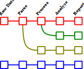
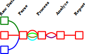

[](https://doi.org/10.5281/zenodo.8319969)

# MagnetoPy

## Installation

While MagnetoPy is still in development, install directly from [the GitHub repository](https://github.com/RinehartGroup/MagnetoPy.git):

```
pip install git+https://github.com/RinehartGroup/MagnetoPy.git
```

## Documentation

Documentation is available at [https://rinehartgroup.github.io/MagnetoPy/](https://rinehartgroup.github.io/MagnetoPy/).

## What is MagnetoPy and why is it useful?

MagnetoPy is a Python package containing tools to aid researchers in the analysis of magnetic data, with a particular emphasis on aiding researchers in developing and publishing new analyses. It contains robust and flexible methods for parsing and processing data files and _transforming the data into standard interfaces_ from which researchers can perform their research. It also contains some record keeping capabilities such that any processing steps performed on the data can be recorded and reproduced at a later date.

MagnetoPy is built with a primary focus on in-depth analysis of magnetic data and development of new analyses. For this reason we mostly envision users of MagnetoPy using it in a notebook environment (e.g., Jupyter notebooks). Once an analysis becomes routine, however, using MagnetoPy as a library in a script is also possible, and will make script/app development easier.

## Experiment and Data File Interfaces

Scientific data analysis typically follows a similar pattern: data is collected, parsed, processed, analyzed, and reported. Each step has some code associated with it. Without some forethought and planning with regard to the architecture, however, the code for each step can become tightly coupled to the code for the other steps. This can make it difficult to reuse code for a particular step in a different context. For example, a researcher trying to use someone else's code may have to rewrite the code relating to the latter steps in that process if their workflow slightly deviates from that of the original researcher. They may even have to rewrite the entire workflow!

<p align="center">
    
</p>

Alternatively, by making well-defined interfaces for each step of the process, the code for each step can be decoupled from the code for the other steps. There may be different implementations of each step -- for example, one researcher's processing step may include a background subtraction, while another researcher's processing step may not -- the code representing the analyis workflow should allow for and record these differences, but subsquent steps in the workflow should not need to know about them.

This decoupled approach means that if the existing code does not already work for a particular researcher's workflow, they can simply write their own implementation of the step that does not work for them, and then use the existing code for the other steps. This is the approach taken by MagnetoPy.

<p align="center">
    
</p>

## Experiment and Data File Interfaces

Consider a project where a group of researchers propose a new model for fitting variable field magnetization (i.e., hysteresis) data. The model ultimately only needs access to field and magnetization data to then return the values of the fit parameters.

Suppose another research group wants to try the analysis on their own data. Assuming the original research group published their code for the analysis, what would the second research group need to do to apply the new model to their data?

Typically, the code used to perform the analysis contains a lot of hard-coded information that is specific to the researchers' data. For example, their code may only work on the format of their particular data files, the particular method of measurement (i.e., DC or VSM measurements), their particular sequence of magnetic fields (e.g. with hard-coded values for the indices of the forward and reverse scans), whether or not they performed any processing of the data (e.g., mass/molar scaling, diamagnetic corrections, background subtraction, normalization, etc.). Thus, there is often an extremely large activation barrier for other researchers to apply the model to their own data, even though the model ultimately only cares about field and magnetization values!

MagnetoPy provides interfaces for experiments that abstract away the details of the data files and measurement methods, allowing researchers to focus on the analysis. In the current example, the researchers would be interested in the `MvsH` class, which provides a standard interface for accessing variable field magnetization data.

After using analyses within MagnetoPy, the serialized form of the magnetometry dataset contains all of the information that future researchers would need to reproduce the analysis, [as shown in this example](https://rinehartgroup.github.io/MagnetoPy/examples/magnetometry/#analyses-and-serialization). This includes the raw data, the processing steps, and the analysis itself. Thus, the activation barrier for other researchers to apply the analysis to their own data is greatly reduced.

### Currently Supported Interfaces

#### Experiments

- [`MvsH`](api/mvsh.md): Variable field magnetization experiments
- [`ZFC`/`FC`](api/zfcfc.md): Zero-field-cooled/field-cooled magnetization experiments

#### Data Files

- [Quantum Design MPMS3 .dat files](api/dat_file.md#magnetopy.data_files.DatFile)
- [Quantum Design MPMS3 .rw.dat files](api/dat_file.md#magnetopy.data_files.DcMeasurement) - note that while the `DcMeasurement` class is available to represent an individual DC measurement (i.e., the voltage data underlying a sinlge magnetic moment data point), the raw voltage data is more likely to accessed via the `DatFile.data` attribute, where the `"raw_scan"` column of the `DataFrame` contains the raw voltage data in the form of `DcMeasurement` objects.
