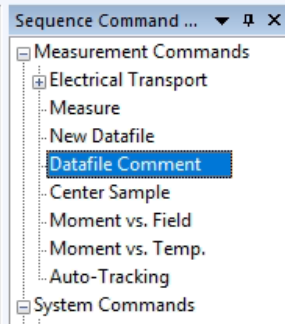
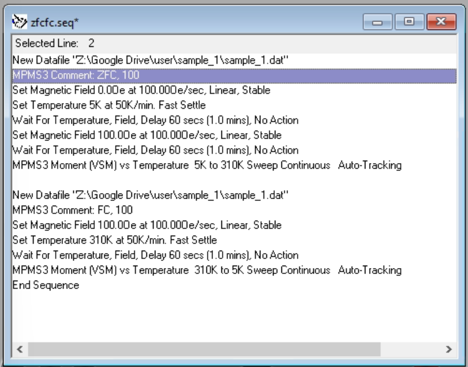

# Parsing Conventions and Capabilities

MagnetoPy can read in a variety of raw magnetic data and convert it to useful Python objects. The following sections describe what sort of file conventions are compatible with MagnetoPy and how the automatic parsing works.

## Sample Info and Moment Scaling

When creating a [`Magnetometry`](../api/magnetometry/#magnetopy.magnetometry.Magnetometry) object, MagnetoPy will assume that all files within the given folder are from the same sample. Thus, the `Magnetometry.sample_info` attribute will be created by looking at the sample information in the header of the first file that it finds.

The sample information is also used to [automatically scale the magnetic moment data in all dc measurements](../api/magnetometry/#magnetopy.magnetometry.Magnetometry.scale_dc_data) (i.e., all `MvsH`, `ZFC`, and `FC` objects within the dataset).

## .dat File Conventions

MagnetoPy determines what experiment(s) is/are contained in a given file by checking the following items in this order:

- comments embedded in the data section of the file (e.g., the section of the file after the row containing "[DATA]" in a Quantum Design MPMP3 .dat file)
- the file name
- the actual data

  <strong>Note:</strong> It is strongly recommended to use the comment method to specify the experiment type, as this removes any ambiguity, and adding support for new experiment types will be easiest with commented files.

### Commented Files

In Quantum Design's MPMS3 MultiVu software, comments are added using the "Datafile Comment" section of the Sequence Command panel.

  

The comment should be placed immediately after setting the file location, as shown in the following example of a sequence containing ZFC and FC experiments.

  

Comments should be comma separated and can be in any order. The following experiments should be commented as follows:

#### MvsH

Comments must include:

- "MvsH" (case insensitive)
- the nominal temperature written as "XX", "XX K", or "XX C" (values without a unit are assumed to be K)

#### ZFCFC, ZFC, FC

Comments must include:

- "ZFC" or "FC" (case insensitive)
- the nominal magnetic field strength written as "XX", "XX Oe", or "XX T" (values without a unit are assumed to be Oe)

## File Names

Recognized file names are (case insensitive):

- "zfcfc"
  - further parsing will assume the file contain a single ZFC/FC experiment
  - further parsing will assume the experiments are in the order ZFC then FC
- "zfc"
  - further parsing will assume the file contain a single ZFC experiment
- "fc"
  - further parsing will assume the file contain a single FC experiment
- "mvsh"
  - further parsing can handle one or multiple MvsH experiments within the same file

### Uncommented Files

Differentiating between files containing ZFCFC and MvsH experiments is done by checking the number of unique field values in the data, since it is assumed that ZFCFC files will only have a single field value.

#### ZFCFC, ZFC, FC

The automatic parsing of uncommented files containing ZFC/FC experiments currently only supports files with a single ZFC/FC pair. The data must be in the order ZFC then FC. The FC experiment can be collected with increasing or decreasing temperature.

#### MvsH

Files containing M vs. H data can contain one or multiple experiments at different nominal temperatures. Due to the temperature fluctuations, experiments are grouped by nominal temperatures using [scikit-learn's DBSCAN clustering algorithm](https://scikit-learn.org/stable/modules/generated/sklearn.cluster.DBSCAN.html). Default values for the `eps` and `min_samples` parameters are provided and can be overwritten during [`MvsH` object creation](../../api/mvsh/#magnetopy.experiments.mvsh.MvsH) or [`Magnetometry.extract_mvsh()`](../../api/magnetometry/#magnetopy.magnetometry.Magnetometry.extract_mvsh)
